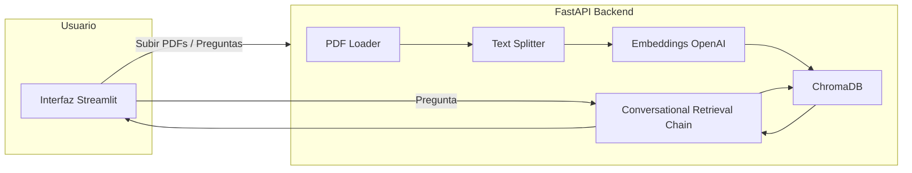

# CatchAI Copiloto PDF

Un asistente conversacional que permite subir hasta 5 archivos PDF, procesarlos y realizar preguntas en lenguaje natural sobre su contenido. El sistema utiliza un flujo de orquestación claro para asegurar respuestas contextuales y precisas.

## Funcionalidades

- **Subida de hasta 5 PDFs**
- **Extracción, división y vectorización de texto**
- **Interfaz conversacional** para preguntas y respuestas
- **Flujo de orquestación estructurado** con LangChain
- **Almacenamiento persistente de vectores** con Chroma
- **Frontend en Streamlit** y **Backend en FastAPI**

**Opcionales incluidos o en planificación:**

- Resumen automático de documentos
- Comparación entre documentos
- Clasificación de temas

## Tecnologías utilizadas

- **Orquestación:** LangChain
- **LLM:** OpenAI `gpt-4o-mini`
- **Embeddings:** OpenAI `text-embedding-3-small`
- **Vector store:** ChromaDB (persistencia local)
- **Frontend:** Streamlit
- **Backend:** FastAPI
- **Contenedores:** Docker + docker-compose

## Justificación de elecciones técnicas

- **OpenAI:** `text-embedding-3-small` para vectorización eficiente, `gpt-4o-mini` para generación de texto y razonamiento con bajo costo.
- **LangChain:** Modular y flexible, integra fácilmente modelos, vector stores y flujos conversacionales.
- **FastAPI:** Rápido, robusto, validación automática y documentación interactiva.
- **Streamlit:** Prototipado rápido, orientado a datos.
- **ChromaDB:** Persistencia local simple de embeddings.
- **Docker:** Asegura consistencia del entorno y facilita despliegue.

## Estructura del Proyecto

```
catchai-copiloto-pdf/
│
├── backend/
│   ├── __init__.py
│   ├── pdf_loader.py         # Procesa y divide PDFs
│   ├── vector_store.py       # Maneja embeddings y base de vectores
│   ├── conversational_ai.py  # Orquestación de LangChain
│   ├── api.py                # Endpoints FastAPI
│
├── vectorstore/               # Datos persistentes de Chroma (ignorado en Git)
│
├── frontend/
│   ├── app.py                 # Interfaz Streamlit
│
├── docker-compose.yml
├── Dockerfile
├── LICENSE
├── requirements.txt
├── .env.example
├── .gitignore
└── README.md
```

## Archivos Mínimos de Placeholder

Actualmente, el proyecto contiene archivos mínimos funcionales que permiten levantar la aplicación en Docker, aunque todavía no tienen la lógica completa:

- **backend/api.py**

```python
from fastapi import FastAPI

app = FastAPI()

@app.get("/")
def read_root():
    return {"message": "Backend placeholder is working!"}
```

- **frontend/app.py**

```python
import streamlit as st

st.title("Frontend placeholder")
st.write("CatchAI Copilot minimal frontend is running!")
```

- **Otros archivos en backend/** (`pdf_loader.py`, `vector_store.py`, `conversational_ai.py`) están vacíos pero listos para ser implementados.

> Nota: Con los placeholders mínimos, la aplicación puede levantarse en Docker y acceder a las URLs del frontend y backend, aunque la funcionalidad completa aún no está implementada.

## Arquitectura del sistema



## Instalación y ejecución

### 1. Clonar repositorio

```bash
git clone https://github.com/tuusuario/catchai-copiloto-pdf.git
cd catchai-copiloto-pdf
```

### 2. Configurar variables de entorno

```bash
cp .env.example .env
```

Editar `.env` con tu clave de OpenAI.

### 3. Construir y ejecutar con Docker

```bash
docker-compose up --build
```

La aplicación estará disponible en:

- **Frontend:** `http://localhost:8501`
- **Backend API:** `http://localhost:8000`

## Flujo conversacional

1. El usuario sube uno o más PDFs.
2. El sistema extrae y divide el texto en fragmentos manejables.
3. Cada fragmento se convierte en un vector usando OpenAI Embeddings.
4. Los vectores se guardan en Chroma con persistencia local.
5. Cuando el usuario hace una pregunta, LangChain busca en los vectores relevantes.
6. GPT-4 genera una respuesta contextual, citando las fuentes.

## Variables de entorno

Archivo `.env.example`:

```env
OPENAI_API_KEY=tu_clave_aqui
```

## Limitaciones actuales y mejoras futuras (Roadmap)

- **Limitaciones Actuales:**

  - Persistencia local de ChromaDB no óptima para despliegues a gran escala.
  - Límite máximo de 5 PDFs.
  - Gestión de errores básica en la interfaz.

- **Mejoras Futuras:**

  - Integración con vector stores en la nube.
  - Resumen, comparación y clasificación avanzada de documentos.
  - Optimización de prompts.
  - Interfaz de usuario mejorada con progreso y estado.
  - Soporte multi-usuario seguro.

## Licencia

Este proyecto se distribuye bajo la licencia MIT.

